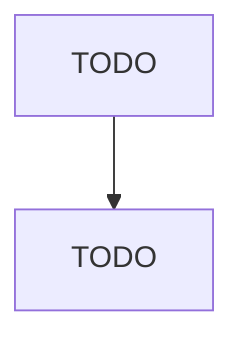

## 배경

[TODO] 어떤 문제/니즈로 시작했나

## 성과

[TODO] 정량적 성과 (예: 응답속도 40% 개선)

## 설계 및 구현

[TODO] 역할/기여, 사용 기술, 판단 근거

```mermaid
graph TD
  A[TODO] --> B[TODO]
```

[TODO-이미지: 아키텍처 다이어그램]

## 운영 및 회고

[TODO] 배포 후 안정화·모니터링·개선 경험
