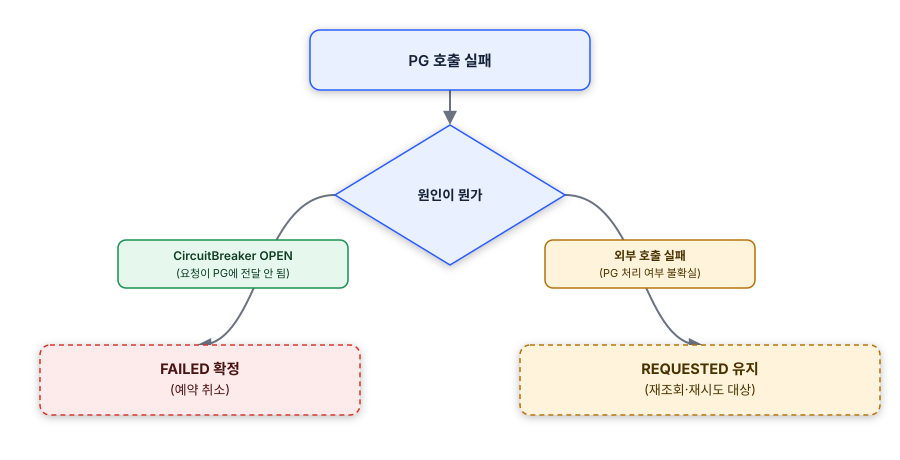
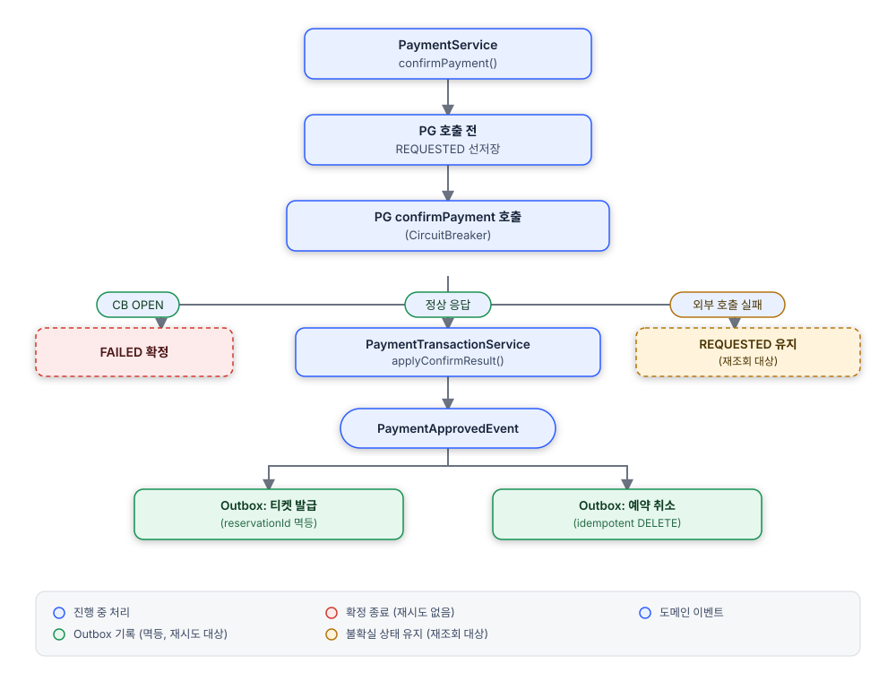

## 현상

PG·티켓팅·예약취소 세 어댑터에 CircuitBreaker를 적용한 뒤, Outbox 재시도 대상에서 PG confirm/cancel을 제외하고 나니 CB fallback 예외가 발생했을 때 Payment/Refund가 DB에 전혀 기록되지 않는 경우가 있었습니다. "PG는 실제로 처리했는데 우리 쪽엔 기록이 없는" 상태가 나올 수 있었고, 재조회할 근거(row) 자체가 없었습니다.

## 원인

Outbox 재시도 대상은 멱등성 기준으로 나눠져 있었습니다. 티켓 발급(reservationId 기준 중복 체크)과 예약 취소(idempotent DELETE)는 재시도 대상에 포함했지만, PG confirm/cancel은 금액이 걸린 비멱등 작업이라 재시도 시 중복 승인·중복 취소 위험 때문에 제외했습니다. 제외 자체는 맞는 판단이었지만, 그 결과 PG 호출이 예외로 끝나면 DB에 아무 기록도 남기지 않는 구조라는 사이드이펙트를 놓쳤습니다.

## 대안 검토

PG 호출 전 Payment/Refund를 REQUESTED로 선저장하는 방식으로 최소 기록을 남기기로 했습니다. 정산 배치·알림 큐까지 갖추는 방안도 검토했지만, 현재 트래픽·운영 규모에서는 오버스펙이라 판단해 스코프에서 제외했습니다.

구현 중에는 모든 실패를 FAILED로 확정하는 방식을 먼저 시도했는데, 이게 오히려 위험하다는 걸 발견했습니다. 외부 호출 실패(타임아웃 등)는 PG가 실제로 처리했을 가능성이 있는데, FAILED로 확정하면 예약이 취소되고 이후 재시도 confirm도 `Payment.approve()`가 막혀 복구가 불가능해졌습니다.

## 조치

실패 원인을 나눠서 처리했습니다. CircuitBreaker OPEN(요청 자체가 PG에 전달되지 않음)은 안전하게 FAILED로 확정하고, 외부 호출 실패(PG 처리 여부가 불확실한 경우)는 REQUESTED로 유지해 재조회·재시도 대상으로만 남겼습니다.

*CB fallback 실패 원인 분기 - CircuitBreaker OPEN은 FAILED, 외부 호출 실패는 REQUESTED 유지*

구현 도중 동시 confirm 요청의 경합 조건도 함께 발견했습니다 — 원인과 조치는 [별도 트러블슈팅 문서](/portfolio/next-frame-payment-confirm-race) 참고.

*confirmPayment 플로우 - REQUESTED 선저장 후 PG 호출, 실패 원인별 확정 분기*

## 결과

PG 호출이 예외로 끝나도 최소 REQUESTED/FAILED 기록이 남아 재조회가 가능해졌고, 실패 원인별로 확정 여부를 나눠 "실제로는 성공했는데 실패 처리되는" 오탐을 방지했습니다. (설계 배경은 [Payment Server 프로젝트 문서](/portfolio/next-frame-payment) 참고)
</content>
