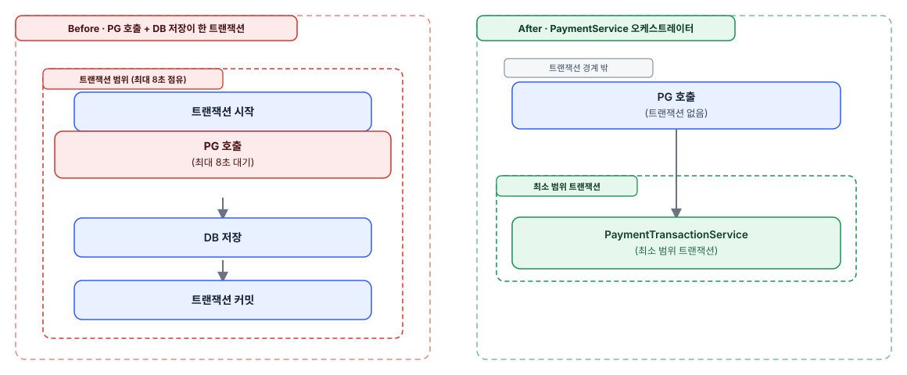

## 현상

결제 승인 흐름에서 외부 PG API 호출과 DB 저장 로직이 하나의 트랜잭션 범위에 묶여 있었습니다. `HttpPaymentGatewayAdapter`의 `connectTimeout 3s + readTimeout 5s` 기준으로, PG 응답이 늦어지면 DB 커넥션 하나가 최대 8초까지 점유될 수 있는 구조였습니다.

## 원인

PG 호출과 DB 저장을 같은 `@Transactional` 메서드 안에서 순차 실행했기 때문에, PG 응답을 기다리는 동안에도 커넥션 풀에서 커넥션을 반납하지 못했습니다. 트래픽이 몰리면 커넥션 풀 소진으로 이어질 수 있는 구조였습니다.

## 대안 검토

PG 호출을 트랜잭션 메서드 밖으로 빼는 방법을 먼저 검토했지만, 그러면 "PG 승인은 됐는데 DB 저장은 실패"하는 부정합이 생길 수 있었습니다. PG 승인 후 저장이 실패하면 PG를 다시 취소하는 보상 트랜잭션도 검토했으나, PG 취소 자체도 실패할 수 있어 보상 로직이 중첩되면 복잡도만 올라간다고 판단해 기각했습니다.

## 조치

"외부 호출은 트랜잭션 밖에서, DB 작업은 최소 범위 트랜잭션"을 원칙으로 세우고 `PaymentService`를 순수 오케스트레이터로 재설계했습니다. `@Transactional`을 제거하고 DB 작업은 `PaymentTransactionService`/`RefundTransactionService`로 위임했습니다.

*DB 커넥션 점유 Before/After - PG 호출을 트랜잭션 경계 밖으로 분리*

## 결과

PG 호출 대기 중에는 커넥션을 점유하지 않게 됐고, 저장 실패 시 롤백 범위도 명확해졌습니다. (설계 배경은 [Payment Server 프로젝트 문서](/portfolio/next-frame-payment) 참고)
</content>
