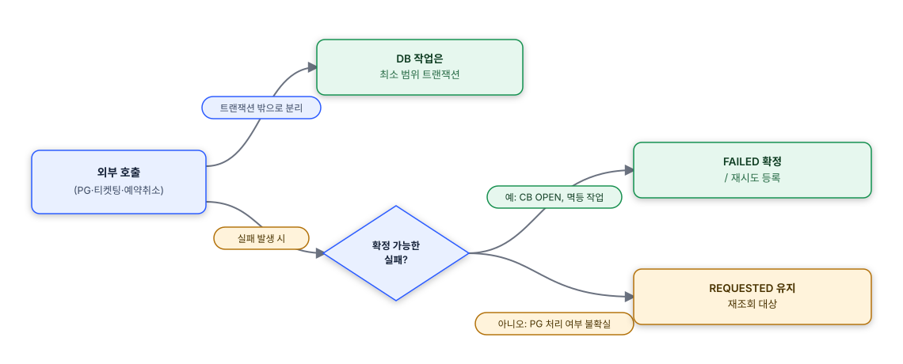

## 배경

공연 좌석을 실시간으로 선점하고 QR 티켓을 발급하는 예매 플랫폼에서, DDD + 헥사고날 아키텍처 기반으로 Payment Server를 설계·구현했습니다. 결제는 금전이 오가는 도메인이라 트랜잭션 경계, 외부 서비스 장애 대응, 재시도 시 부정합 방지를 설계 초기부터 원칙으로 세워야 했습니다.

## 성과

- 외부 PG 호출과 DB 트랜잭션을 분리해, PG 응답 지연 시 최대 8초까지 발생하던 DB 커넥션 점유 문제 해소
- 결제 후속 작업(티켓 발급·예약 상태 변경) 유실 위험을 DB 기반 Outbox 패턴으로 해소, 지수 백오프 재시도로 안정화
- PG 호출이 예외로 실패해도 최소 상태 기록이 남아 재조회 가능한 구조로 전환
- 구현 중 발견한 트랜잭션 경계·동시성·장애 대응 이슈 4건은 별도 트러블슈팅 문서로 정리

## 설계 및 구현

결제는 금전이 오가는 도메인이라, 구현 과정에서 마주친 문제들은 결국 하나의 원칙으로 수렴했습니다 - **외부 호출은 트랜잭션 밖에서 처리하고, 실패는 확정할 수 있는 경우와 없는 경우를 나눠 다르게 다룬다.**

*실패 처리 원칙 - 확정 가능 여부에 따라 FAILED/REQUESTED로 분기*

구현 중 마주친 구체적인 문제와 판단 과정은 트러블슈팅 문서로 정리했습니다.

- [DB 커넥션 점유 문제](/portfolio/next-frame-db-connection-pool) — PG 호출과 DB 트랜잭션이 묶여 최대 8초까지 커넥션이 점유되던 구조 문제
- [Outbox 저장 누락](/portfolio/next-frame-outbox-atomicity) — `AFTER_COMMIT` 트랜잭션 경계 버그로 Outbox 기록이 반영되지 않던 문제
- [CB fallback 시 기록 누락과 실패 확정 오탐](/portfolio/next-frame-cb-fallback-gap) — 멱등성 기준 재시도 대상 분리와 REQUESTED 상태 도입
- [confirm 동시 요청 경합 조건](/portfolio/next-frame-payment-confirm-race) — reservationId unique 제약 위반 경합 조건

**Outbox 패턴 도입 배경**

후속 작업(티켓 발급·예약 상태 변경)을 단순 재시도로 처리하기엔 한계가 있었습니다. 앱 재시작 시 재시도 상태가 사라지고, 트랜잭션 커밋 전 이벤트를 발행하면 커밋 실패 시 이미 나간 이벤트를 되돌릴 수 없었습니다. 분산 시스템의 at-least-once delivery 문제로 보고 트랜잭셔널 Outbox 패턴을 도입했습니다. Kafka 도입도 검토했으나 팀 규모·인프라 수준에서는 오버엔지니어링이라 판단해 DB 기반 Outbox로 결론냈습니다.

구조가 정말 필요한지 검증하려 Outbox를 걷어내고 동기 플로우(티켓 발급 실패 시 즉시 PG 취소)로 단순화를 실험했으나, PG 취소도 외부 API 호출이라 실패할 수 있어 "결제는 됐는데 티켓도 없고 환불도 안 된" 더 심각한 부정합이 나올 수 있음을 확인했습니다. Outbox로 복귀해 구조의 필요성을 직접 검증했고, 결제 커밋 후 `AFTER_COMMIT`에서 Outbox에 기록, 스케줄러가 5s→30s→2m→10m 순 지수 백오프로 재시도, 4회 실패 시 FAILED로 전환하는 구조로 정착했습니다.

**운영 및 회고**

정산 배치·알림 큐·재조회 스케줄러는 이번 스코프에서 의도적으로 제외했습니다. 최소 기록을 남기는 것만으로 재조회 근거는 확보되고, 자동화된 정산까지는 현재 트래픽/운영 규모에서 오버스펙이라 판단했기 때문입니다.
