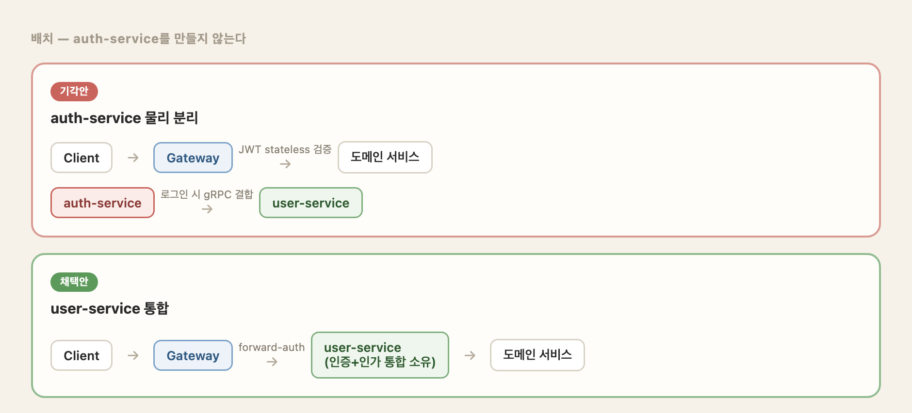
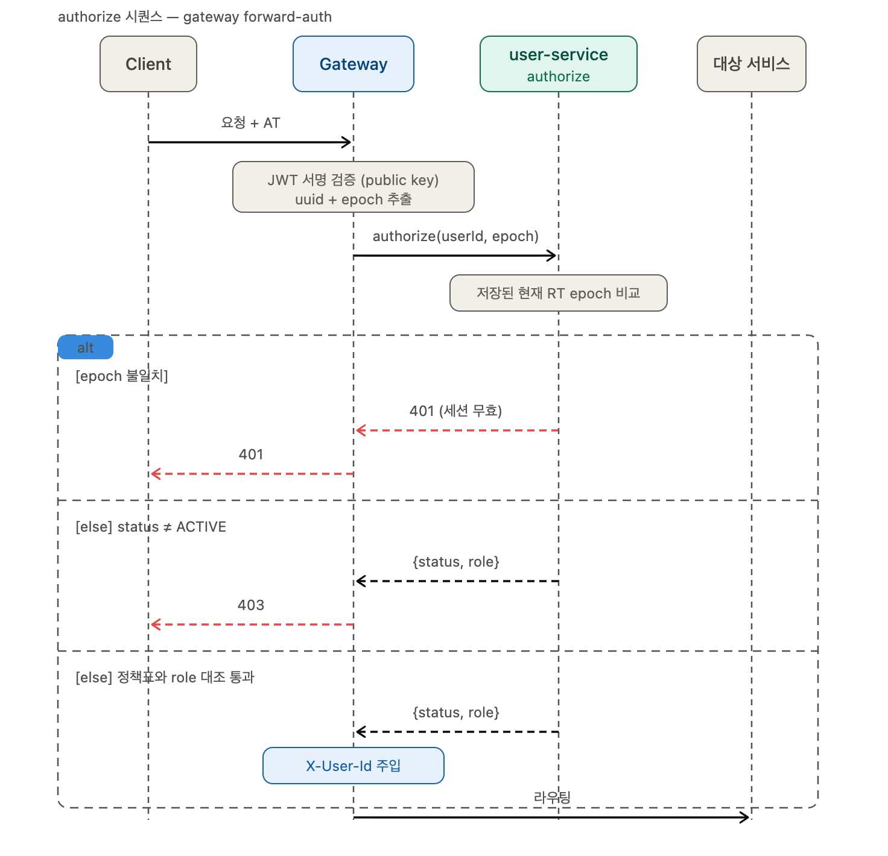
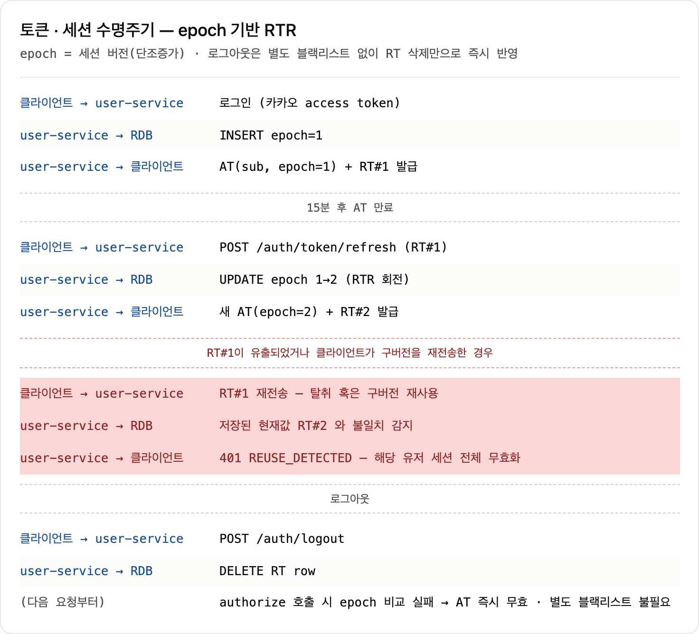

## 배경

[AI Agent 마켓플레이스](/portfolio/prompthub-overview)에서 인증/인가 아키텍처를 맡았습니다. 초기 설계는 auth-service를 물리적으로 분리해 로그인 시 gRPC로 user-service와 결합하고, 인가는 gateway가 stateless로 JWT를 검증한 뒤 Redis 블랙리스트로 실시간 차단을 보강하는 방향이었습니다. 구현 착수 전 설계 검증 단계에서 이 두 결정을 동시에 뒤집을 근거들이 확인되어, 아래 네 가지를 다시 설계했습니다.

**원칙**

- gateway는 상태를 갖지 않고 서명 검증과 라우팅만 담당합니다.
- 인증·인가 데이터와 그 판단은 user-service가 전부 소유합니다.

| 초기안                                | 채택안                                    |
| ---------------------------------- | -------------------------------------- |
| auth-service 물리 분리 + 로그인 시 gRPC 결합 | [1. auth-service를 따로 만들지 않음](#1-auth-service를-따로-만들지-않음) |
| role 스냅샷 claim / RT는 Redis 단독        | [2. 토큰 - claim은 sub+epoch만, RT는 RDB 원본 + Redis 캐시](#2-토큰---claim은-subepoch만-rt는-rdb-원본--redis-캐시) |
| gateway가 Redis 직접 참조               | [3. 인가 - forward-auth로 중앙화](#3-인가---forward-auth로-중앙화) |
| 컨트롤러 진입점마다 세션 폐기 부착                | [4. 세션 폐기 - 상태 전이 지점에 앵커링](#4-세션-폐기---상태-전이-지점에-앵커링) |

## 성과

| 지표                 | Before             | After                                 |
| ------------------ | ------------------ | ------------------------------------- |
| role·status 반영 지연  | 최대 15분 (발급 시점 스냅샷) | 매 요청 실시간 조회                           |
| 로그아웃 후 토큰이 유효했던 구간 | 최대 15분 (AT 만료까지)   | 다음 요청부터 즉시 무효 (epoch 비교, fail-closed) |
| 정지·탈퇴·승급 반영 지연 상한  | 정의 없음              | 즉시(명시적 evict), 최악의 경우도 60초           |

카카오 로그인 자체의 보안 결함도 같은 검증 과정에서 발견해 수정했습니다 - [별도 트러블슈팅 문서](/portfolio/prompthub-oauth-vulnerability) 참고.

## 설계 및 구현

### 1. auth-service를 따로 만들지 않음

- **문제**: 개발서버가 JVM 프로세스를 하나 더 띄울 메모리 여유가 없었고, "도메인 서비스는 인가 코드 없이 비즈니스 로직만 수행한다"는 팀 방침도 같은 시점에 정해졌습니다. 원래 설계(auth-service 분리 + 로그인 시 gRPC 결합)는 이 두 조건과 부딪혔고, User 생성과 Auth 연동이 두 서비스에 걸쳐야 해서 한쪽만 성공했을 때 계정이 어느 쪽으로도 완결되지 않은 상태로 남는 분산 트랜잭션의 부분 실패 리스크도 안고 있었습니다.
- **결정**: 인증(카카오 로그인·재발급·로그아웃)과 인가 데이터를 전부 user-service가 소유하는 배치로 전환해 분산 부분 실패 문제 자체를 없앴습니다.
- **트레이드오프**: user-service가 전 인증 트래픽의 동기 의존점이 되어, 재기동 중에는 로그인·재발급은 물론 인증이 필요한 다른 도메인 서비스 API까지 전부 멈춥니다. 개발 환경에서의 단일 인스턴스에서는 수용한 문제, 운영 전환 시엔 다중 인스턴스가 필수 조건입니다.

*auth-service 분리 기각안과 forward-auth 채택안 비교*

### 2. 토큰 - claim은 sub+epoch만, RT는 RDB 원본 + Redis 캐시

- **문제**: role claim을 발급 시점 스냅샷으로 태그에 담는 방식은 최대 AT TTL(15분) 동안 갱신되지 않아, 판매자 승급 같은 상태 변화가 늦게 반영됐습니다.
- **결정**: role·status처럼 신선도가 필요한 값은 토큰에 넣지 않고 매 요청 forward-auth가 원본에서 읽습니다. claim은 sub(uuid)와 epoch(세션 버전, RT 재발급마다 1씩 증가)만 남겼습니다 - epoch은 세션의 순번만 가리켜 role·status와 달리 stale 문제가 없습니다.

**RT 저장 방식 대안 비교**

| 대안                     | 리스크                                                              |
| ---------------------- | ---------------------------------------------------------------- |
| Redis 단독 저장            | Redis 유실 시 전 활성 유저가 한꺼번에 재로그인으로 몰리는 "로그인 쇄도"로 인증 경로 전체 붕괴        |
| RDB 원본 + Redis 캐시 (채택) | 회전 시 RDB 먼저 갱신, 두 저장소가 어긋나면 RDB가 우선 - Redis가 죽어도 재발급은 RDB로 계속 동작 |

판단 기준을 "단일 EC2로 돌아가는 지금 규모"가 아니라 "컴포넌트별 장애 도메인이 독립적인 실무 규모"로 잡았습니다.

- **추가 도입**: 재발급마다 RT를 교체하는 RTR(Refresh Token Rotation)과 재사용 감지를 추가했습니다.

### 3. 인가 - forward-auth로 중앙화

forward-auth는 gateway가 요청을 라우팅하기 전에 인가 판단만 user-service에 위임해 확인받는 방식입니다.

**검토한 대안**

| 대안                                  | 기각 이유                                                                                 |
| ----------------------------------- | ------------------------------------------------------------------------------------- |
| gateway가 Redis를 직접 읽어 role·블랙리스트 판정 | 트래픽 규모가 커서 앞단 차단의 이득이 클 때 유리한 패턴인데, 우리 규모에서는 그 이득보다 gateway가 상태 저장소에 의존하게 되는 운영 비용이 더 큼 |
| 서비스별 인가 필터(security-starter 모듈)     | 설정·구현이 서비스마다 중복되고, 필터 누락이 곧 차단 구멍이 되는 구조                                              |

gateway가 Redis 블랙리스트를 직접 들고 앞단에서 차단하는 패턴 자체는 실무에서도 흔한 선택입니다. 다만 그 패턴이 유리한 건 트래픽 규모가 커서 앞단 차단으로 도메인 서비스까지 가는 요청을 줄이는 이득이 클 때인데, 개발서버 단일 인스턴스로 돌아가는 팀 프로젝트 규모였던 상황에서는 그 이득보다 gateway가 상태 저장소(Redis)에 의존하게 되면서 장애 도메인이 늘어나는 운영 비용이 더 크다고 판단했습니다. 그래서 인가 관련 상태는 전부 auth 도메인(user-service)에 두는 원칙을 일관되게 적용하는 쪽을 택했습니다.

- **결정**: gateway는 JWT 서명 검증(public key)까지만 하고, uuid+epoch을 추출해 user-service의 내부 API `authorize(userId, epoch)`를 호출합니다. epoch 불일치는 401(fail-closed), status≠ACTIVE는 거부, role은 gateway가 자체 정책표와 대조합니다.
- **세부값 근거**: 정책표(경로→필요 role)는 `@ConfigurationProperties`로 외부화했지만, `/admin/**` → ADMIN 캐치올만은 설정이 아니라 코드에 하드코딩된 기본값으로 고정했습니다 - 설정 파일 오류로 가장 위험한 보호선이 조용히 사라지는 걸 막기 위해서입니다. 정책표 파싱에 실패하면 기동 자체를 fail-fast로 중단시킵니다.
- **장애 대응**: authorize 응답은 60초 TTL로 캐시하고(상태 변경 시 즉시 무효화), Redis 장애 시엔 DB 직접 조회로 fallback합니다 - 인가는 fail-open이 불가능한 값이라 느려지는 것까지만 허용했습니다.

*좌: authorize 요청 시퀀스 · 우: epoch 기반 RTR 토큰·세션 수명주기*

### 4. 세션 폐기 - 상태 전이 지점에 앵커링

- **문제**: 정지·탈퇴 시 RT 삭제와 authorize 캐시 무효화를 어디에 붙일지가 문제였습니다. 컨트롤러 진입점마다 붙이면 호출 경로가 늘어날 때(관리자 API, 추후 admin-service, 본인 탈퇴 등) 누락 가능성이 계속 열려 있었습니다.
- **결정**: 이 부수효과를 컨트롤러가 아니라 user-service의 상태 전이 도메인 메서드(`user.withdraw()` 등)에 붙여, user-service 내부에서는 호출자가 누구든 상태가 바뀌는 지점을 하나로 고정했습니다. admin-service는 스키마 전체에 읽기·쓰기 권한이 있어 같은 물리 테이블에 직접 UPDATE하지만, API를 경유하지 않는 대신 상태 변경 직후 같은 Redis 캐시 키를 명시적으로 evict해 즉시 반영되도록 맞췄습니다 - evict가 실패해도 최악의 경우 캐시 TTL 60초 안에는 정합합니다.
- **로그아웃 처리**: RT 삭제만으로 다음 요청부터 즉시 반영됩니다(위 다이어그램 참고). gateway는 여전히 상태 없이 유지되고, epoch 비교는 이미 상태를 가진 user-service의 authorize 안에서 처리해 신규 네트워크 홉 없이 기존 왕복에 검사 하나만 얹었습니다.
- **한계**: 전제는 "유저당 활성 세션 1개"입니다 - 멀티 디바이스 로그인을 지원하게 되면 epoch을 세션 단위로 재설계해야 하는데, 지금 미리 대비하지 않고 그 시점에 다시 검토하기로 했습니다.

