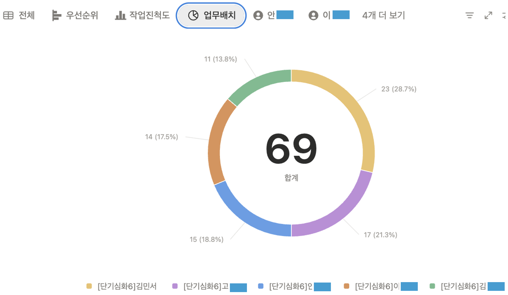
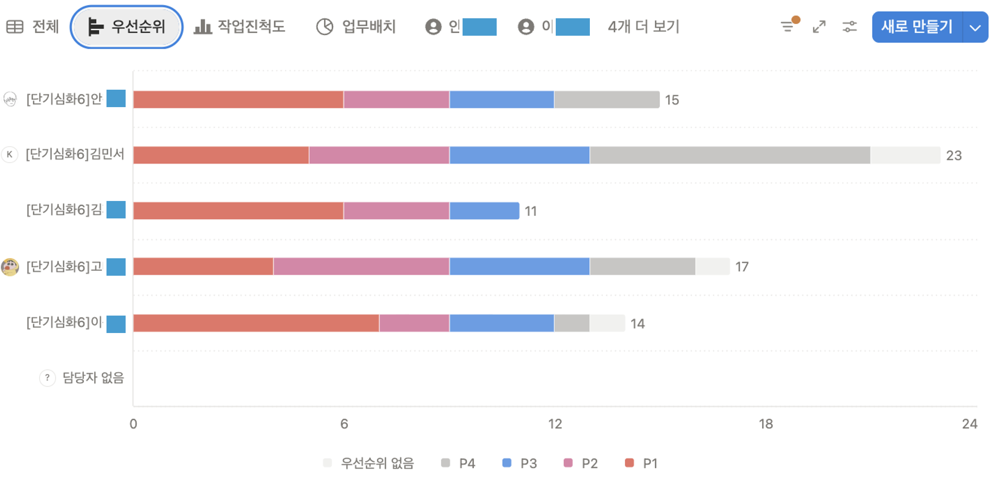
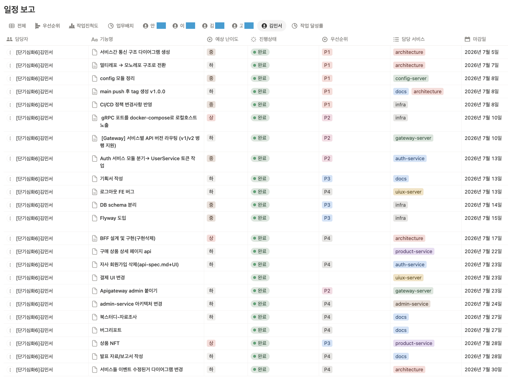
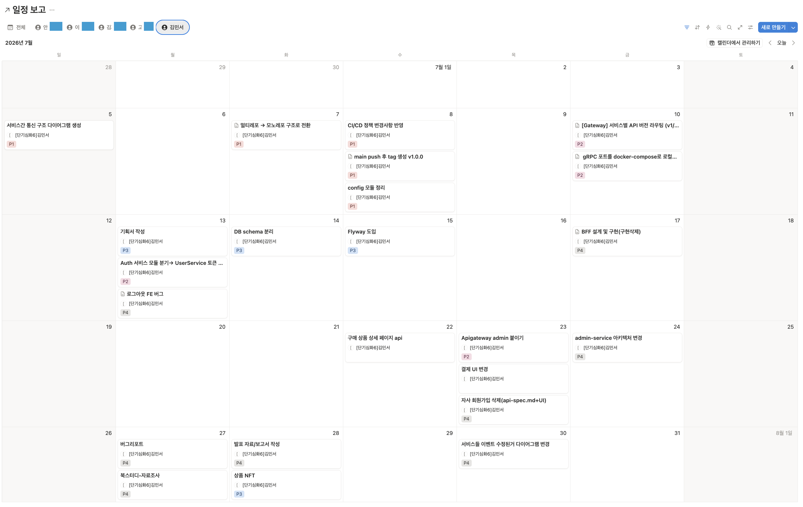
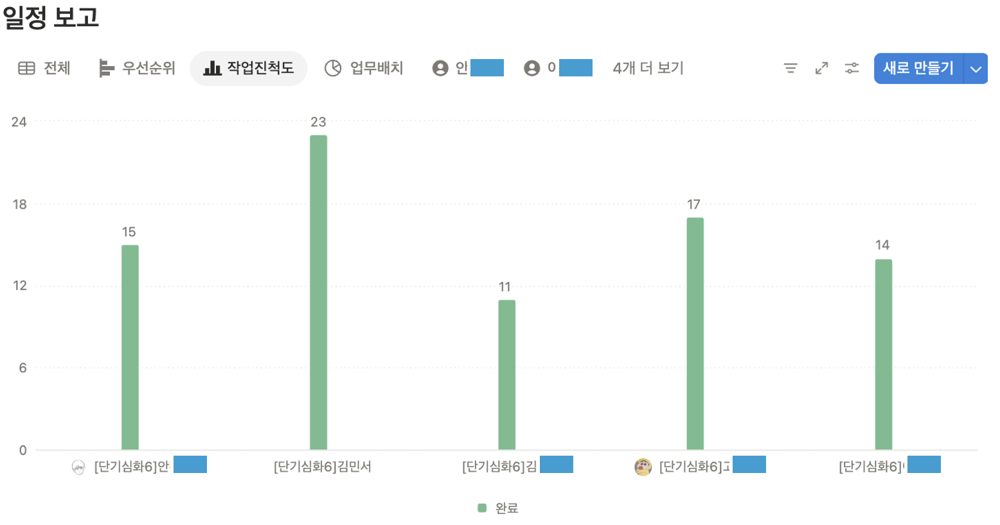

## 배경

세미 프로젝트를 한 달간 진행하면서 두 가지 문제를 확인했습니다. "다 했다"는 보고와 달리 실제 코드를 열어보면 구조가 잘못 설계되어 있거나 동작하지 않는 경우가 있었고, 업무 배분과 마감이 명확히 공유되지 않아 기한을 놓치는 일이 반복됐습니다.  
원인은 개인 역량보다 업무 현황이 팀 전체에 보이지 않는 구조에 있다고 판단했습니다. 각자 무엇을 언제까지 해야 하는지 확인할 장치가 없었고, AI로 코드를 빠르게 생성한 뒤 충분한 검증 없이 넘어가는 경우도 있었습니다.  
이 상태로 파이널 프로젝트 제출까지 남은 한 달을 그대로 진행하면 원하는 결과를 끝내지 못할 수 있다고 봤습니다.

## 성과

- PO 담당 업무를 User + API Gateway에서 API Gateway로 조정하고, 남는 시간을 팀 일정관리에 배분
- Notion 업무관리 DB + **매일 아침 데일리 스크럼**으로 남은 한 달 마일스톤과 팀원별 **업무·우선순위**를 팀 전체가 확인 가능하게 함
- 이슈·버그 공유를 망설이던 분위기에서, 매일 이슈를 공유하는 흐름으로 자리잡음
- 기한 내 업무 100% 완료

## 판단 및 진행

가장 먼저 제 역할 범위를 조정했습니다. 세미프로젝트 한 달 동안 PO이자 팀원으로 User와 API Gateway 두 도메인을 맡고 있었지만, 담당 범위를 API Gateway로 줄이고 남는 시간을 팀원 일정관리에 쓰기로 했습니다. 기능을 하나 더 구현하는 것보다, 팀 전체가 남은 한 달 안에 무엇을 언제까지 끝내야 하는지 아는 것이 우선이라고 판단했기 때문입니다.

이를 위해 Notion에 업무관리 페이지를 만들고 필요한 정보를 데이터베이스 하나에 모았습니다. 남은 한 달 전체 마일스톤을 다시 짜고, 팀원별 개별 업무를 등록한 뒤 회의로 우선순위를 정했습니다.

*좌: 팀원별 업무배치 도넛 차트 · 우: 우선순위(P1~P4)별 작업 뷰*

팀원들은 이 페이지만 보면 오늘까지 자신이 뭘 해야 하는지 바로 파악할 수 있었습니다.

*좌: 담당 기능별 일정 테이블 · 우: 마감일 캘린더 뷰*

매일 아침 데일리 스크럼으로 진행 상황을 확인해 Notion에 반영했습니다.

*팀원별 작업진척도 - 완료 작업 개수 막대그래프*

또 하나는 이슈 공유였습니다. 초기 팀원들이 버그나 이슈를 먼저 공유하는 것을 망설이는 분위기여서 제가 먼저 GitHub에 올라온 이슈를 확인하고 담당자에게 직접 질문을 던졌습니다.  
한두 명이 답하기 시작하자 이후에는 "혹시 공유할 만한 이슈나 버그 있나요?"라고 물으면 해당하는 사람이 바로 답하는 흐름이 생겼고, 지식 공유가 자연스러운 분위기로 자리 잡았습니다.

**운영 및 회고**

이 역할 조정의 트레이드오프는 저의 기술 구현 시간이 줄어드는 것이었습니다.  
다만 다른 팀원들의 코드 리뷰가 자연스럽게 저에게 몰리는 구조였고, 그 과정에서 모르는 부분을 질문하거나 찾아보며 기술적으로 뒤처지지 않을 수 있었습니다.  
결과적으로 팀은 마감기한을 지키게 됐고, 저는 일정관리·이슈 공유 프로세스를 만드는 과정에서 소프트스킬이 늘어난 계기가 됐습니다.

→ [당시 사용한 Notion 업무관리 페이지](https://playful-shield-230.notion.site/po-schedule-manage?source=copy_link)