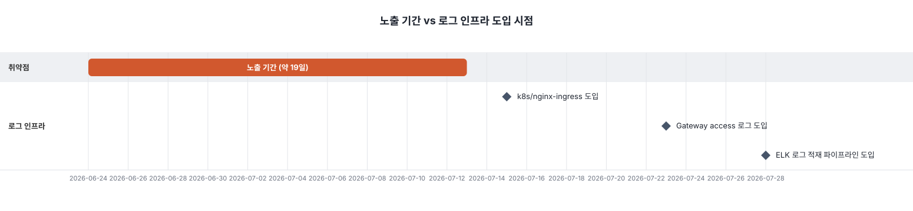

## 용어

- "자기신고형 인증": 클라이언트가 주장하는 신원 정보를 서버가 제3자(IdP) 검증 없이 그대로 신뢰하는 결함을 가리키는 설명적 표현(세관·세무의 자진신고제에서 따온 비유)
- 공식 분류: OWASP API Security Top 10 2023 - API2:2023 Broken Authentication, CWE-290(Authentication Bypass by Spoofing) 계열

## 현상

- 엔드포인트: `POST /api/v2/auth/oauth/{provider}` (user-service)
- 요청 스펙: `OAuthLoginRequest(kakaoId, nickname, profileImage, email)` — 전부 클라이언트가 자체 주장(self-reported)하는 값
- 프론트가 카카오 SDK로 조회한 `authId`·`email`을 그대로 body에 담아 전달했고, 백엔드는 이 값을 검증 없이 신뢰해 토큰을 발급했습니다
- 신원 확인의 근원인 카카오 서버를 한 번도 거치지 않고 클라이언트 주장을 그대로 DB에 반영하는 구조여서, 타인의 카카오 ID를 body에 넣어 요청하는 것만으로 그 계정의 토큰이 발급됐습니다

## 발견 경위

- 장애 신고나 버그 리포트가 아니라, [인가 아키텍처 재설계(ADR-0008)](/portfolio/prompthub-auth-gateway)를 검증하는 과정에서 기존 로그인 흐름을 다시 짚어보다 발견했습니다
- 사후 대응이 아니라 설계 리뷰 중 능동적으로 찾아낸 결함입니다

## 원인

- 신원 확인의 근원인 카카오 서버(`kapi.kakao.com`)를 거치지 않고, 클라이언트가 주장하는 신원 정보를 그대로 신뢰하는 구조였습니다
- OAuth 흐름에서 지켜야 할 원칙(신원 검증은 서버가 provider에게 직접 확인)을 위반한 전형적인 API2:2023 Broken Authentication 패턴이었습니다

## 조치

- 프론트: 카카오 access token(또는 인가 코드)만 서버로 전달하도록 변경했습니다
- 백엔드: user-service가 `kapi.kakao.com/v2/user/me`를 서버 측에서 직접 호출해 `oauthId`·`email`을 획득하도록 전환했습니다(`KakaoUserInfoClientAdapter`, 포트-어댑터 구조로 편입)
- 부수 효과: 원래 auth-service를 물리 분리해 로그인 시 User 생성과 Auth 연동을 gRPC로 묶으려던 계획(구 ADR-0003)이 인가 아키텍처 재설계 과정에서 취소되면서, 두 기록을 단일 로컬 트랜잭션으로 처리할 수 있게 됐습니다. User는 생성됐지만 Auth 연동은 실패해 로그인이 안 되는 분산 부분 실패 문제도 함께 해소됐습니다

## 결과

git log로 직접 확인한 타임라인입니다.

| 날짜               | 이벤트                                        | 커밋         |
| ---------------- | ------------------------------------------ | ---------- |
| 2026-06-24 11:47 | 취약 코드 최초 도입 (client-supplied 신원 그대로 신뢰)    | `47ada3d6` |
| 2026-06-24 16:51 | 같은 날 인증 관련 보안 버그 6건 수정 — 이 결함은 미포함, 그대로 남음 | `809c6c8e` |
| 2026-07-13 14:09 | 수정 커밋 — 서버 측 카카오 검증 도입                     | `3256db04` |

- 두 경계 커밋 모두 `git merge-base --is-ancestor`로 develop의 조상 커밋임을 확인했습니다 → 실제 개발서버에 배포돼 있었습니다(이 프로젝트는 운영서버 없이 develop 머지가 곧 개발서버 배포)
- 노출 기간은 약 19일이며, 그 기간 개발서버 엔드포인트는 인터넷에 공개된 상태였습니다

클라이언트가 주장하는 신원 정보를 서버가 어떤 경우에도 신뢰하지 않는 구조로 전환해, 타인 카카오 ID만으로 계정을 탈취하는 경로를 봉인했습니다.

## 운영/리스크 대응

- DB(user/auth 테이블)를 직접 확인해 노출 기간 중 실제 접속자가 팀원뿐이고 외부 악용 흔적이 없음을 확인했습니다
- 다만 이 결함의 특성상 "팀원의 실제 카카오 ID를 도용해 그 팀원인 척 로그인"하는 시나리오는 DB row만으로는 본인 로그인과 구분되지 않아, 이 가능성은 완전히 배제하지 못했습니다
- 로그로도 교차검증할 수 있는지 확인했으나, 노출 기간 당시엔 검증 가능한 access 로그 자체가 존재하지 않았습니다

*취약점 노출 기간과 로그 인프라 도입 시점 - 관측 인프라가 결함 수정보다 최대 15일 늦게 도입*

- 당시 배포 형태는 순수 EC2 docker-compose(k8s 이전)였고, stdout이 있었더라도 적재 파이프라인이 없어 지금은 확인할 수 없습니다. DB 확인이 이 기간에 대해 존재하는 유일한 증거입니다

이 경험으로 판단한 것은 다음과 같습니다.

- 인증·인가처럼 보안 민감도가 높은 기능을 다루기 시작하는 시점엔, **기능 구현보다 access log·audit log 같은 observability 인프라를 먼저 갖춰야 합니다**
- 이번엔 로그 인프라가 결함 수정보다 10일 늦게 들어와서, 사후에 "정말 아무도 악용하지 않았는지"를 로그로 100% 확인할 방법이 없었습니다
- 다음 프로젝트/스프린트에서는 인증 관련 기능 착수 시 observability를 선행 태스크로 순서를 바꿀 계획입니다

