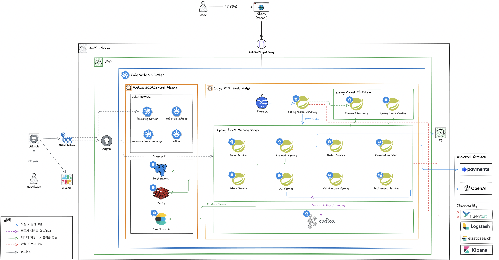
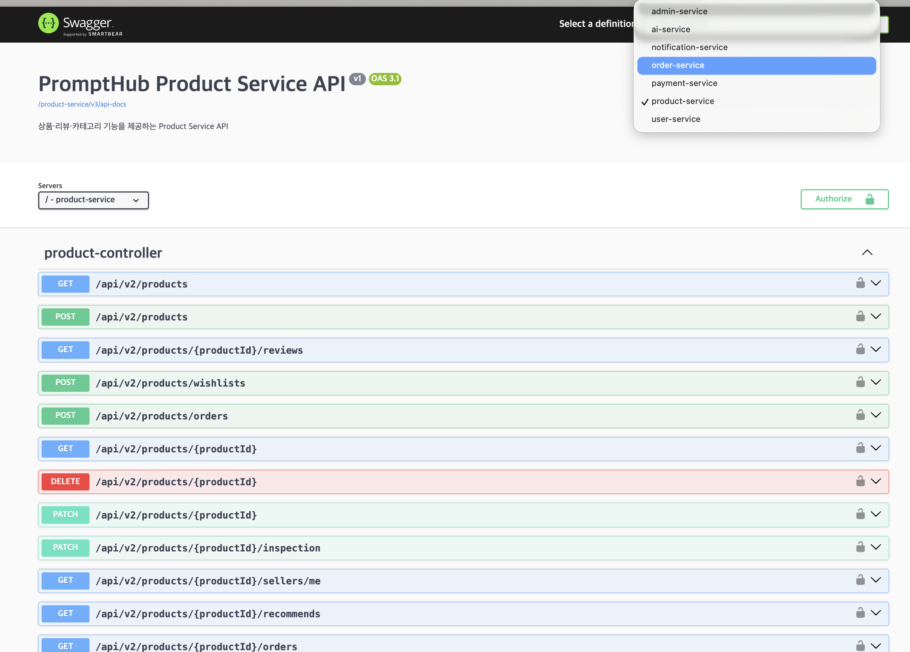
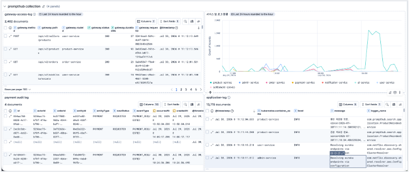
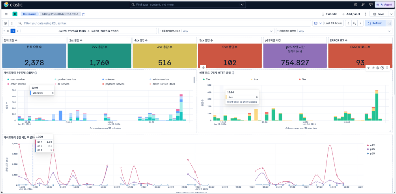

## 개요

*서비스 마스코트 프로미*

AI Agent 마켓플레이스는 admin·ai·notification·order·payment·product·user·settlement 총 8개 서비스와 API Gateway로 구성된 MSA 팀 프로젝트입니다. 팀원 4명이 각자 도메인 서비스를 구현했고, 본인은 팀 리더 겸 PO로 서비스 기획과 전체 아키텍처 설계를 맡았습니다. 이 페이지는 프로젝트 전체의 구조·기술 스택을 정리한 개요이며, 개별 의사결정과 트러블슈팅은 아래 [관련 문서](#관련-문서)에 각각 분리해 기록했습니다.

[Backend Github Repo 바로가기](https://github.com/prgrms-be-adv-devcourse/beadv6_6_3JMT_BE)  
[Frontend Github Repo 바로가기](https://github.com/prgrms-be-adv-devcourse/beadv6_6_3JMT_FE)

## 시스템 아키텍처

*AWS 기반 인프라 아키텍처 - k8s 클러스터·8개 마이크로서비스·Kafka·Observability 스택*

Gateway는 상태를 갖지 않고 서명 검증·라우팅만 담당하며, 인증·인가 판단은 user-service가 전담합니다.  
화면 하나에 여러 서비스 데이터가 필요할 때는 프론트가 각 서비스의 공개 REST API를 직접 호출·조합합니다.  
상품 등록 시에는 Kafka 이벤트로 ai-service에 LLM 자동검수를 요청합니다.  
settlement-service는 클라이언트가 직접 호출하지 않고 크론 스케줄러가 배치로 실행하며, 정산 원천 라인은 order-service에서 내부 gRPC로 당겨옵니다.

## 기술 스택

- **백엔드**: Spring Boot, Spring Cloud Gateway, MSA
- **인증/보안**: JWT (RS256), OAuth
- **데이터**: PostgreSQL, Redis
- **AI/메시징**: Spring AI, Kafka
- **서비스 간 통신**: gRPC, REST API
- **모니터링**: Elasticsearch, Kibana

## API 문서

[Swagger UI (product-service)](http://13.209.136.116/swagger-ui/index.html?urls.primaryName=product-service)

settlement-service는 REST API 없이 크론잡으로 뜨는 배치 서버라 Swagger 목록에는 나타나지 않습니다.

*Swagger UI - product-service API 목록*

## 모니터링

Kibana로 gateway 액세스 로그·결제 감사 로그·서비스별 요청 추이를 추적합니다.

*Kibana - gateway 액세스 로그·결제 감사 로그·서비스별 요청 추이*

*Kibana 대시보드 - 요청 수·상태 코드별 응답 수·응답 시간 p50/p95/p99*

## 관련 문서

- [인증/인가 아키텍처 - auth-service 분리 취소와 forward-auth 중앙화](/portfolio/prompthub-auth-gateway)
- [상품 콘텐츠 준-복제 탐지](/portfolio/prompthub-content-duplicate-detection)
- [서비스 간 통신 경계 재정의](/portfolio/prompthub-service-boundary)
- [카카오 로그인 자기신고형 인증 결함](/portfolio/prompthub-oauth-vulnerability)
- [기능/이슈 관리 체계](/portfolio/prompthub-issue-management)
- [PR 220개 리뷰 + QA 병행](/portfolio/prompthub-pr-review-and-qa)

