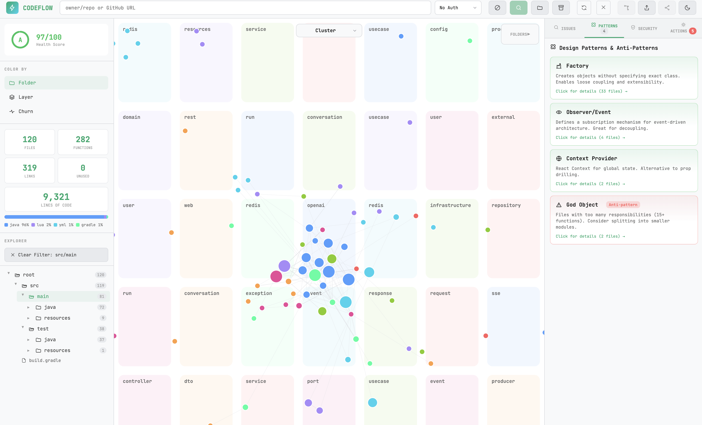
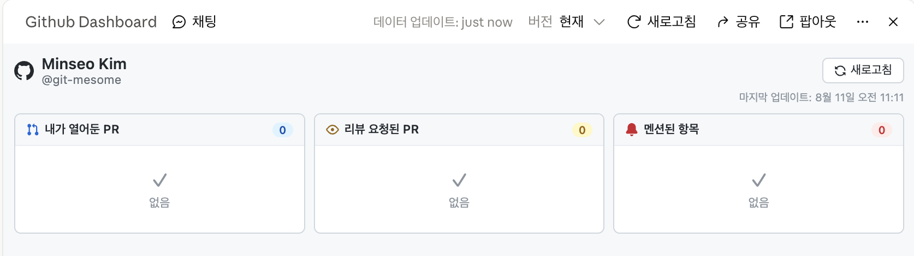
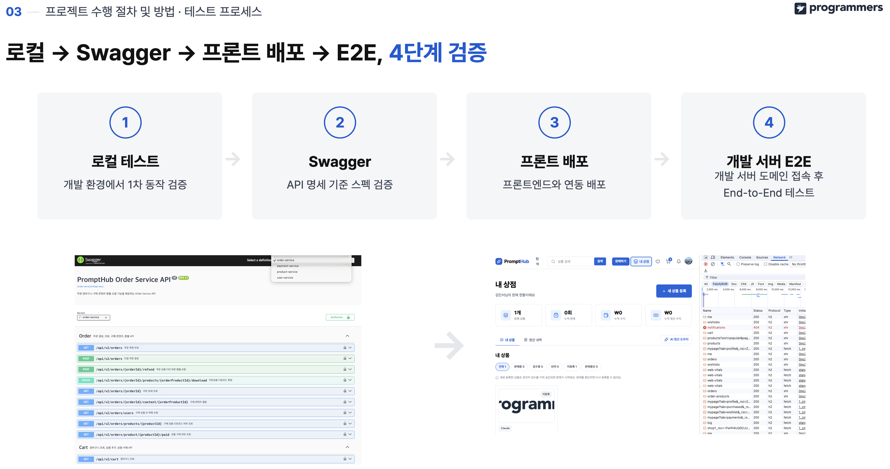

## 배경

- 초반엔 팀원 5명 전원을 리뷰어로 지정해, 시간 되는 사람이 그때그때 랜덤으로 PR을 봐주는 방식으로 운영했습니다.
- 첫 1주는 정상적으로 운영되는 것처럼 보였지만, 시간이 지날수록 각자 자기 구현에 바빠지며 패키지 구조·아키텍처를 확인하지 않고 PR 문서만 보고 대충 승인하는 사례가 나타났습니다.
- PR 문서에는 적혀 있는 기능이 실제 코드에는 없는 경우도 발견했습니다.
- 결국 코드베이스가 더렵혀지게 됐고, 세미 프로젝트 마감이 다가올수록 커밋 30개가 한 번에 올라오는 등 리뷰 자체가 불가능한 PR을 올리는 사례까지 나왔습니다.
- 이 상태를 팀 회의로 공유하고(관련: [마감을 놓치던 팀에 제시한 이슈 관리 체계](/portfolio/prompthub-issue-management)), 제가 리뷰를 전담하기로 결정했습니다.

## 성과

- 백엔드 PR 220개(현재 closed 기준)를 리뷰어 1명(본인)으로 전담 검토
- QA를 병행해 버그 30개 이상 직접 발견
- 코드베이스 정적 분석 도구(CodeFlow)를 별도로 돌려 이슈를 추가로 생성
- 개인 기능 구현 시간을 줄이는 대신, 팀 전체 코드베이스를 리뷰 관점에서 파악

## 판단 및 진행

팀원 4명이 기능 구현에 집중하는 동안, 본인이 리뷰어 역할을 전담하기로 팀 회의에서 결정했습니다 - 개인 구현량을 늘리는 대신, PR 하나하나를 검토해 도메인 간 정합성과 코드 일관성을 담당하는 쪽으로 시간을 배분했습니다.

담당 기능 구현 작업도 있어 PR을 실시간으로 확인하기 어려웠던 문제는, **AI로 개인용 GitHub 대시보드를 만들어** 해결했습니다. "**내가 열어둔 PR·리뷰 요청된 PR·멘션된 항목**"을 한 화면에서 모아 보고, 정각마다 한 번씩 몰아서 리뷰하는 규칙을 세웠습니다.

QA는 아래 순서로 진행했습니다.

1. PR 문서를 읽고 설계가 파악 안 되는 부분 질문
2. 코드베이스 패키지 구조가 팀이 합의한 아키텍처대로 구현됐는지 확인
3. 다른 사람의 서비스 코드를 건드리지 않았는지 확인(실제로 사례가 있었음)
4. 코드가 길면 IntelliJ에서 브랜치를 열어 메서드를 따라가며 파악
5. 트랜잭션 분리가 필요한 지점을 지적
6. 의도를 드러내는 클래스·메서드 명명을 지적
7. 머지 후에는 스웨거로 실제 동작을 확인하도록 요청
8. 개발서버에 직접 들어가 버그를 확인하고, 발견하면 프론트 또는 백엔드에 버그·리팩터 이슈를 생성

## **운영 및 회고**

리뷰어 1명 구조는 병목이 될 수밖에 없었고, 실제로 팀원들이 리뷰를 기다린 적이 있습니다.

프로젝트 착수 시점에 이미 정해둔 우선순위 기준으로 급한 것부터 리뷰한다고 안내하고 대기시켰습니다.  
다음 작업을 위해 승인을 서둘러 달라는 팀원에게는, 새 브랜치(워크트리)를 파서 먼저 진행하거나 나중에 리베이스해서 머지하는 방법을 제안해 설득했습니다.

개인 기능 구현량은 줄었지만, 그만큼 팀 전체 코드를 리뷰 관점에서 파악하게 됐다는 게 이 트레이드오프의 다른 쪽입니다.  
정해진 기한 안에서 무엇을 남기고 무엇을 포기할지 먼저 판단한다는 원칙을, 이번엔 "내 기능 구현"을 포기하는 쪽으로 적용한 사례였습니다.
