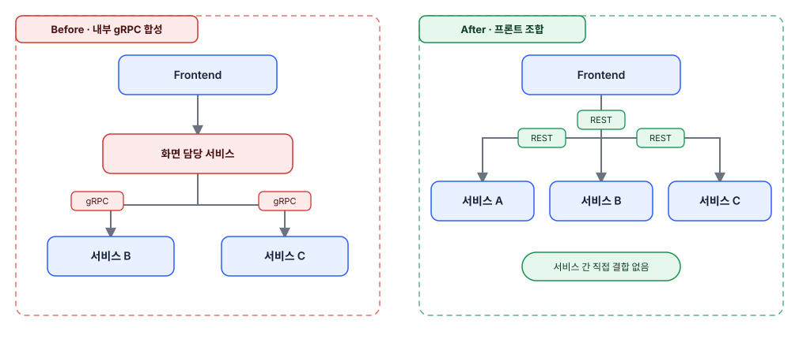

## 배경

- MSA로 서비스는 분리했지만, 초기 설계는 "각자 자기 데이터만 책임진다"가 아니라 "백엔드가 화면에 필요한 데이터를 전부 상하차해서 내려준다"는 전제로 설계하였습니다.
- 화면 하나를 채우려면 그 화면을 맡은 서비스가 나머지 서비스를 내부 gRPC로 호출해 백엔드에서 합성한 뒤 프론트에 하나의 응답으로 내려주는 구조가 기본값이 됐습니다.

## 성과

- AI가 반복해서 확신 있게 낸 "지금처럼 내부 gRPC로 묶는 게 적합하다"는 아키텍처 결론을, 근거를 캐물어 검증한 결과 실제로는 근거 없는 합리화(환각)였음을 확인했습니다.
- AI 확인만으로 멈추지 않고 외부 실무자 2명에게 실제 구조를 보여주고 피드백을 받았습니다.
- 그 결과를 바탕으로 내부 gRPC로 결합돼 있던 화면 합성 로직을 제거하고, 프론트가 여러 공개 REST API를 직접 호출·조합하는 구조로 전환해 서비스 간 결합도를 낮췄습니다.

## 설계 및 구현

**1. 발견 - AI 검증 실패**

- BFF(Backend for Frontend) 도입을 검토하며 설계를 반복해서 손보는 동안, AI에게 계속 방향을 물었습니다.
- AI는 "지금처럼 내부 통신(gRPC)으로 묶는 게 적합하다"는 결론을 매번 냈습니다.
- 그 결론이 어떤 추론으로 나온 건지 캐묻자 근거가 무너졌습니다 - 실제 근거가 있어서 낸 결론이 아니라 그럴듯하게 합리화한 것에 가까웠습니다.

**2. 실무자 검증**

- AI 확인만으로는 부족하다고 판단해 외부 실무자 2명에게 설계 구조를 직접 보여주고 물었습니다.
- 두 분 모두 잘못된 구현이라고 지적했습니다 - 서비스 간 결합도가 이 정도로 높으면 차라리 모놀리식으로 가는 게 낫다는 평가였습니다.

**3. 조치와 제약**

- BFF 자체는 방향으로 맞다고 판단해 학습 후 도입을 시도했지만, 개발 서버에 모듈을 하나 더 띄울 메모리 여유가 없었습니다.
  - BFF를 코드에 도입하지 않은 이유는 메모리 자원 제약이고, 결합도·트래픽·비용을 저울질한 원칙적 판단은 아니었습니다.
- 대신 내부 gRPC로 묶여 있던 화면 합성 로직을 제거하고, 프론트가 여러 서비스의 공개 REST API를 직접 호출·조합하는 구조로 전환했습니다.
- 현재 원칙: 서비스 소유 데이터 성격의 내부 배치성 조회(예: 정산이 주문의 정산 원천 라인을 당겨오는 경로)는 gRPC 유지, 화면 조합용 데이터는 공개 REST + 프론트 조합

*서비스 간 통신 경계 Before/After - 내부 gRPC 합성에서 프론트 REST 조합으로 전환*

**4. 근본 원인 - 기술 선택이 아니라 산출물 부재**

- 결합도 폭발의 공통 원인은 gRPC냐 REST냐가 아니라, 도메인 간 설계 회의와 그 산출물이 없었다는 점도 있습니다.
- 초기 서비스 내부 통신 스펙을 회의로 정하지 않고 각자 필요한 대로 그때그때 요청·구현했고, 서비스 간 관계를 다이어그램으로 그리지 않고 AI 구현에 의존해 결합 구조를 파악할 사람이 없어졌습니다.

**5. 운영 및 회고 - 겪은 안티패턴**

MSA를 충분히 학습하지 않고 도입한 팀이 겪는 문제를 거의 다 겪었다고 생각합니다.

1. gRPC 라우팅을 먼저 굳혔다가 개발 도중 REST로 전면 전환 - 프론트 수정·백엔드 API 신규·기존 gRPC 삭제를 한꺼번에 치렀습니다.
2. 다른 서비스가 소유한 데이터를 자기 스키마에 테이블로 복제해 들고 있어, 서비스 경계를 무의미하게 만들었습니다.
3. 이벤트 유실 방지에 집착해 "유실 시 gRPC로 재조회"만 생각했습니다 - Kafka를 쓰면서도 수신 측이 자기 속도로 처리한다는 Kafka 원칙과 맞지 않는 발상이었습니다.
4. 컴퓨팅 자원(서버 메모리)을 모듈 설계에 반영하지 않아, 나중에 자원 부족으로 원칙과 무관한 임기응변(모듈 합치기)이 필요해졌습니다 - BFF 도입 무산이 이 문제의 재현입니다.
5. 문제를 인식한 뒤에도 AI에게만 계속 물어보는 데 그치고 팀에 공유하지 않았습니다 - 실무자 검증까지 끌고 가지 않았다면 이 결합 문제는 계속 방치됐을 것입니다.

결론: AI의 아키텍처 조언은 근거를 캐물어야 검증되고, 그래도 확신이 안 서면 실무자·팀 회의를 거쳐야 합니다. 이 사건을 계기로 이후 AI가 내는 아키텍처 제안에는 항상 이 절차(근거 확인 → 필요시 실무자/팀 검증)를 적용하고 있고, 지금도 유지하고 있습니다.

**6. 트레이드오프 - 프론트가 떠안은 부담**

- BFF·캐시 계층 없이 프론트가 여러 API를 직접 호출해 조합하면서, API별로 다른 실패 정책을 프론트가 관리해야 하는 부담이 생겼습니다.
- 여러 호출의 순서·조합(waterfall) 로직이 백엔드가 아니라 프론트 코드에 있게 되는 부담도 함께 생겼습니다.

